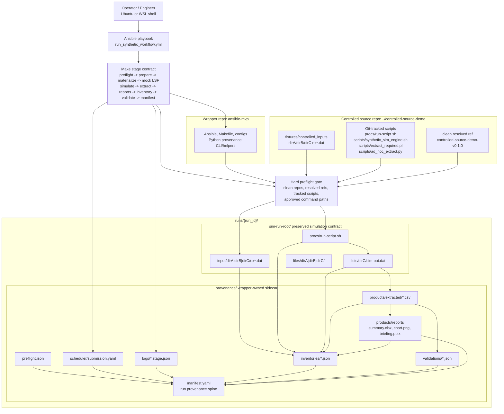

# Provenance-First Simulation Workflow MVP

Runnable local MVP for a provenance wrapper around an existing engineering simulation workflow.

## Purpose

This repository demonstrates a **provenance-first MVP** for an engineering data workflow. The goal is not to replace the simulation engine, create a data warehouse, or introduce a full orchestration platform. The goal is to prove a repeatable pattern for:

- creating a run workspace,
- enforcing Git-controlled source/scripts,
- running a synthetic simulation workflow,
- capturing inputs, scripts, execution metadata, logs, outputs, and derived products,
- generating a human-readable `manifest.yaml`.

The MVP is intended to run locally on Ubuntu/WSL and serve as a template for later adaptation to RHEL HPC login nodes and LSF-managed compute execution. On Windows hosts, run the commands from inside Ubuntu/WSL, not from native PowerShell or CMD, so `make`, `bash`, Unix-style paths, and Ansible resolve consistently.

## Pre-MVP Baseline Workflow

The diagram below captures the current simulation/data workflow before adding the provenance-first MVP wrapper. It is the baseline the MVP should preserve and instrument, not replace.


## Implemented MVP Wrapper Architecture

The MVP wraps the baseline workflow with a provenance gate, stage contract, evidence sidecar, and manifest assembly while leaving the simulation runtime shape intact.



## MVP Boundary

In scope:

- synthetic end-to-end demo,
- Ansible as the outer execution harness,
- Makefile as the local stage definition,
- Python helper utilities for inventory, hashing, validation, and manifest generation,
- mock LSF submission metadata,
- strict Git entrance gate for controlled source and scripts,
- preservation of the canonical simulation run layout,
- provenance-controlled derived products outside the simulation root.

Out of scope:

- production deployment to target HPC,
- real LSF integration,
- DVC or artifact vaulting,
- Parquet warehouse/lakehouse design,
- Tableau integration,
- full schema/type validation,
- replacing legacy Perl/Python extraction logic,
- storing large generated data in Git.

## Expected Repository Pattern

The MVP uses two repositories:

```text
workspace/
├── provenance-mvp/           # this repo: Ansible, Make, provenance helpers
└── controlled-source-demo/    # Git-controlled synthetic simulation/scripts
```

The controlled source repository is a hard entrance criterion. Workflow scripts must be tracked in Git at a clean, resolved commit. The MVP should fail fast if required scripts are untracked, dirty, or sourced from arbitrary filesystem paths.

## Canonical Run Layout

Each run creates an outer run workspace:

```text
runs/{run_id}/
├── sim-run-root/
│   ├── files/
│   │   ├── dirA/
│   │   ├── dirB/
│   │   └── dirC/
│   ├── input/
│   │   ├── dirA/
│   │   │   ├── ex1.dat
│   │   │   ├── ex2.dat
│   │   │   └── ex3.dat
│   │   ├── dirB/
│   │   │   ├── ex1.dat
│   │   │   ├── ex2.dat
│   │   │   └── ex3.dat
│   │   └── dirC/
│   │       ├── ex1.dat
│   │       ├── ex2.dat
│   │       └── ex3.dat
│   ├── lists/
│   │   ├── dirA/
│   │   ├── dirB/
│   │   └── dirC/
│   └── procs/
│       └── run-script.sh
└── provenance/
    ├── manifest.yaml
    ├── preflight.json
    ├── logs/
    ├── inventories/
    ├── scheduler/
    ├── validations/
    │   ├── manifest_smoke.json
    │   └── required_extract.json
    └── products/
        ├── extracted/
        └── reports/
```

`sim-run-root/` preserves the simulation runtime contract. `provenance/` is the wrapper-owned sidecar for evidence, logs, validation results, manifest data, and derived analytical products.

## Directory Semantics

- `sim-run-root/input/`: controlled and simulation input files.
- `sim-run-root/lists/`: primary raw simulation outputs, including delimited and flat outputs.
- `sim-run-root/files/`: supplementary simulation outputs.
- `sim-run-root/procs/`: materialized runtime invocation scripts.
- `provenance/products/extracted/`: derived CSV outputs generated from raw simulation outputs.
- `provenance/products/reports/`: generated XLSX/PPTX/figure artifacts.
- `provenance/logs/`: stage logs and stage evidence for simulation, extraction, and report generation; Ansible itself runs the Make contract rather than writing a separate wrapper log file.
- `provenance/manifest.yaml`: the run-level provenance spine.

The repeated `dirA`, `dirB`, and `dirC` folder names are intentional. Tools and manifests must identify artifacts by full relative path, simulation area, and logical group, not by leaf directory name alone.

## Tooling

Expected local tools:

- Ubuntu/WSL
- Git
- Make
- Ansible
- Python 3.11+
- Perl
- `uv`

Python dependencies are managed through `uv` from `pyproject.toml`/`uv.lock`. The MVP uses PyYAML, openpyxl, python-pptx, pytest, ruff, and basedpyright for runtime helpers, reporting, tests, linting, formatting, and type checks.

For IDE/editor setup, use the Python environment created by `uv` and enable Ruff plus basedpyright-compatible type checking. See [`docs/how_to_use_this_mvp.md`](docs/how_to_use_this_mvp.md) for practical IDE notes.

## Quickstart

For a step-by-step operator handoff, troubleshooting notes, and safe extension rules, see [`docs/how_to_use_this_mvp.md`](docs/how_to_use_this_mvp.md).

Run these commands from a Linux shell, such as Ubuntu/WSL on Windows. If you are starting from Windows, either open the WSL distribution first or invoke the command through `wsl`; do not run the workflow directly in PowerShell or CMD.

Bootstrap the synthetic controlled source repository:

```bash
make bootstrap-controlled-source
```

Run the synthetic workflow:

```bash
ansible-playbook ansible/playbooks/run_synthetic_workflow.yml \
  -i ansible/inventory/localhost.ini \
  -e run_id=demo_001 \
  -e controlled_source_repo=../controlled-source-demo \
  -e controlled_source_ref=controlled-source-demo-v0.1.0
```

Expected result:

```text
runs/demo_001/provenance/manifest.yaml
runs/demo_001/provenance/preflight.json
runs/demo_001/provenance/products/extracted/required.csv
runs/demo_001/provenance/products/extracted/ad_hoc.csv
runs/demo_001/provenance/products/reports/summary.xlsx
runs/demo_001/provenance/products/reports/chart.png
runs/demo_001/provenance/products/reports/briefing.pptx
runs/demo_001/provenance/logs/
runs/demo_001/provenance/inventories/
runs/demo_001/provenance/scheduler/submission.yaml
runs/demo_001/provenance/validations/required_extract.json
runs/demo_001/provenance/validations/manifest_smoke.json
runs/demo_001/sim-run-root/lists/
runs/demo_001/sim-run-root/files/
```

If a run fails partway through, keep `runs/{run_id}/` for inspection and debugging. The MVP does not define safe resume semantics or attempt history for partial runs, so after fixing the cause, start a fresh run with a new `run_id` unless future resume behavior is explicitly implemented.

Run the local quality gate before closing code changes:

```bash
make check
```

Reconcile the active OpenSpec change and bead hygiene with:

```bash
openspec validate scaffold-runnable-provenance-mvp --type change --strict --json
bd lint --json
```

## Make Targets

```text
make bootstrap-controlled-source
make preflight
make prepare-workspace
make materialize-inputs
make materialize-procs
make submit-mock-lsf
make run-simulation
make extract-required
make extract-ad-hoc
make build-reports
make inventory-pre
make inventory-post
make validate
make manifest
make manifest-smoke
make format
make lint
make typecheck
make test
make check
make clean
```

The Ansible playbook invokes these Make targets in the order configured by `ansible/inventory/group_vars/all.yml`: `preflight`, workspace preparation, materialization, mock LSF submission, simulation, extraction, reporting, inventories, validation, manifest assembly, and manifest smoke validation. For focused debugging, keep the same `RUN_ID`, `CONTROLLED_SOURCE_REPO`, and `CONTROLLED_SOURCE_REF` values and do not bypass `make preflight`.

## Controlled Source Gate

Before execution, `make preflight` verifies:

- controlled source repository exists,
- requested ref/tag/commit resolves,
- worktree is clean,
- required scripts are tracked by Git,
- required scripts are addressed by repo-relative paths,
- no stage executes untracked scripts from arbitrary filesystem locations.

The manifest records:

- repository path,
- requested ref,
- resolved commit,
- branch/tag/describe output,
- dirty status,
- tracked script paths,
- script hashes.

## Hashing Policy

Use SHA-256 as the default hash algorithm.

Always hash:

- scripts,
- configuration,
- playbooks,
- Makefile,
- small controlled inputs,
- derived CSV/report products in the synthetic demo.

For large production raw outputs, the future policy may record size and modification time by default, with content hashing available as an explicit opt-in.

## Manifest Expectations

`manifest.yaml` includes the implemented provenance spine:

- run identity,
- timestamps,
- repository state,
- controlled source gate result,
- input inventory,
- materialization mode for each input,
- mock scheduler metadata,
- stage commands/status/timestamps/log paths,
- raw simulation output inventory,
- derived product inventory,
- validation results,
- hash status for tracked artifacts,
- notes/open warnings.

## LSF Integration Placeholder

The synthetic MVP emulates LSF behavior only through `make submit-mock-lsf`, which writes `provenance/scheduler/submission.yaml`. The manifest reserves space for future production metadata such as:

- `bsub` command,
- LSF job ID,
- queue,
- requested resources,
- submit host,
- execution host(s),
- `bjobs` final snapshot,
- `bhist` output,
- `bacct` output,
- final scheduler status.

## Acceptance Criteria

A successful MVP run should satisfy:

- `ansible-playbook ...` completes successfully on Ubuntu/WSL.
- A run workspace is created under `runs/{run_id}/`.
- The canonical `sim-run-root/` shape is preserved.
- Derived products are written under `provenance/products/`, not inside `sim-run-root/`.
- Required scripts come from a clean Git-controlled source repository.
- The run fails if required scripts are untracked or the controlled source worktree is dirty.
- `manifest.yaml` captures the complete synthetic run story.
- Basic row/column/header-count validation is performed for the required CSV product and recorded in `provenance/validations/required_extract.json`.
- Tests and the manifest smoke check verify inventory, hashing, and manifest generation.

## Known Limitations and Deferred Production Decisions

- Real LSF integration is deferred; no `bsub`, `bjobs`, `bhist`, or `bacct` commands are required by this MVP.
- Failed or partial runs are inspectable but not safely resumable in the MVP; use a new `run_id` after fixing the failure unless future resume semantics are implemented.
- The production hash policy for very large outputs remains deferred; the local synthetic demo hashes small controlled inputs and derived products with SHA-256.
- Manifest validation is currently lightweight: required sections/key values are smoke-checked rather than validated against a formal schema.
- Long-term artifact archival, cataloging, promotion, and release workflows are intentionally outside this scaffold.

## Current Design Principle

Build the provenance spine first.

Do not solve archival, warehousing, cataloging, or full orchestration until the MVP proves that generated analytical artifacts can be traced back to controlled source, inputs, execution context, raw outputs, extraction stages, and reporting products.
