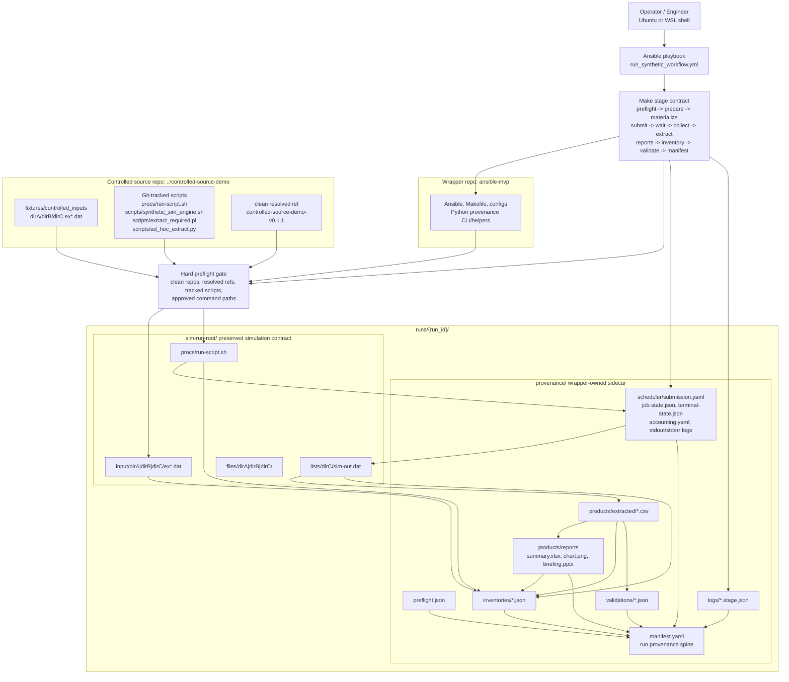

# Architecture and Design Notes

This document explains how the MVP is put together and why each tool owns the
role it does. It is reference material: read [`../README.md`](../README.md)
first for the short story, [`how_to_use_this_mvp.md`](how_to_use_this_mvp.md)
to operate the workflow, and
[`trace_required_csv.md`](trace_required_csv.md) to see the provenance chain
in action.

## Role summary

```text
Ansible:   where/how to run
Make:      stable local stage names
Python:    what the stages mean
Git:       what source is controlled
Mock LSF:  who owns execution
Manifest:  what happened
```

## Pre-MVP baseline workflow

The diagram below captures the simulation/data workflow before the
provenance-first wrapper. It is the baseline the MVP preserves and instruments,
not something it replaces.


## Wrapper architecture

The MVP wraps the baseline workflow with a provenance gate, stage contract,
evidence sidecar, and manifest assembly while leaving the simulation runtime
shape intact.



## Why each tool owns its role

### Why Ansible

Ansible is intentionally thin. It is not the workflow engine and does not own
provenance semantics. The repo-local Make/Python contract owns stage behavior,
scheduler evidence, validation, and manifest assembly. Ansible provides the
operational harness: environment admission, variable injection, per-stage task
visibility, fail-fast sequencing, and a future remote-host execution seam.

Concretely, the playbook asks the Python helper for the configured stage order
(`provenance list-run-stage-targets`) and then runs one `make <target>` per
task boundary. Ansible scaffolds the environment; Python scaffolds the run.

### Why Make

Make is the current local stage contract because it is ubiquitous, inspectable,
and available in restrictive environments. It gives stable target names for
Ansible and humans. It should not own provenance semantics. Future versions may
replace Make with a more expressive local workflow runner while preserving the
Python provenance contracts and manifest model.

### Why Python

Python owns the provenance decisions: validating controlled source,
materializing run inputs/scripts, hashing artifacts, modeling scheduler state,
checking extraction preconditions, validating products, and assembling the
manifest. Anything that computes, decides, or leaves evidence lives in
`src/provenance/`, not in shell or YAML.

The implementation follows modern typed-Python practices — `src/` layout,
typed helpers, structured config parsing, ruff, basedpyright, and pytest —
because provenance code is contract-heavy. Type checks and tests are not
decorative; they prevent evidence-shape drift in configs, scheduler state,
stage records, and manifest assembly.

### Why `uv`

This MVP uses `uv` to run the Python tooling and quality gates reproducibly
from the repository. Another approved environment manager, such as conda or a
managed virtualenv workflow, could fill the same role if required by the target
environment. The important contract is that Python dependencies and commands
are reproducible and project-local — not `uv` itself.

### Why Git as the entrance gate

Git-controlled source and scripts are a hard entrance criterion. Preflight
fails if required repos are missing, refs do not resolve, worktrees are dirty,
scripts are missing or untracked, or stage commands point at uncontrolled local
paths. There is deliberately no non-Git fallback for workflow scripts.
Generated run products never belong in Git.

### Why mock LSF

The mock LSF layer emulates the minimal scheduler contract the team actually
uses: submit one monolithic job, wait/check terminal status, and collect
accounting-style evidence. It models the scheduler boundary, not the cluster.
See [Scheduler seam](#scheduler-seam) below.

### Why no CI/git-hook trigger

The workflow is sparse and human-gated. External inputs can be vaulted when
delivered, then an operator can start a controlled HPC run from the vaulted
delivery. Git-hook CI is intentionally deferred because the trigger is not the
hard part; controlled source, scheduler truth, and evidence are.

## Repository pattern

The MVP uses two sibling repositories:

```text
workspace/
├── ansible-mvp/              # this repo: Ansible, Make, provenance helpers
└── controlled-source-demo/   # Git-controlled synthetic simulation/scripts
```

## Canonical run layout

Each run creates an outer run workspace:

```text
runs/{run_id}/
├── sim-run-root/
│   ├── files/
│   │   ├── dirA/
│   │   ├── dirB/
│   │   └── dirC/
│   ├── input/
│   │   ├── dirA/ex1.dat ex2.dat ex3.dat
│   │   ├── dirB/ex1.dat ex2.dat ex3.dat
│   │   └── dirC/ex1.dat ex2.dat ex3.dat
│   ├── lists/
│   │   ├── dirA/
│   │   ├── dirB/
│   │   └── dirC/
│   └── procs/
│       └── run-script.sh
└── provenance/
    ├── manifest.yaml
    ├── preflight.json
    ├── logs/
    ├── inventories/
    ├── scheduler/
    ├── validations/
    │   ├── manifest_smoke.json
    │   └── required_extract.json
    └── products/
        ├── extracted/
        └── reports/
```

`sim-run-root/` preserves the simulation runtime contract. `provenance/` is
the wrapper-owned sidecar for evidence, logs, validation results, manifest
data, and derived analytical products.

### Directory semantics

- `sim-run-root/input/`: controlled and simulation input files.
- `sim-run-root/lists/`: primary raw simulation outputs, including delimited
  and flat outputs.
- `sim-run-root/files/`: supplementary simulation outputs.
- `sim-run-root/procs/`: materialized runtime invocation scripts.
- `provenance/products/extracted/`: derived CSV outputs generated from raw
  simulation outputs.
- `provenance/products/reports/`: generated XLSX/PPTX/figure artifacts.
- `provenance/scheduler/`: local async mock-LSF submission, terminal job
  state, accounting, and scheduler stdout/stderr evidence.
- `provenance/logs/`: stage logs and `*.stage.json` evidence for every
  configured workflow stage, including support stages such as preflight,
  materialization, inventories, and manifest assembly.
- `provenance/manifest.yaml`: the run-level provenance spine.

The repeated `dirA`, `dirB`, and `dirC` folder names are intentional. Tools
and manifests must identify artifacts by full relative path, simulation area,
and logical group, never by leaf directory name alone.

## Stage contract and ordering

The run configuration (`configs/run.synthetic.yaml`) is the single source of
truth for stage order. Ansible asks the Python helper for the configured Make
target order and runs one target per task boundary:

```text
preflight -> prepare-workspace -> materialize-inputs -> materialize-procs
-> inventory-pre -> submit-mock-lsf -> wait-mock-lsf -> collect-mock-lsf
-> extract-required -> extract-ad-hoc -> build-reports
-> validate -> inventory-post -> manifest -> manifest-smoke
```

`run-simulation` remains a Make target for focused debugging and payload stage
evidence, but normal Ansible runs execute the payload only through the
scheduler boundary. The manifest's concise `workflow.operator_flow` therefore
shows submit, wait, collect, extract, report, and validate phases rather than
direct simulation execution.

`inventory-pre` records pre-run input/script evidence before mock LSF
submission; `inventory-post` records output evidence after validation.

## Controlled source gate

Before execution, `make preflight` verifies:

- controlled source repository exists,
- requested ref/tag/commit resolves,
- worktree is clean,
- required scripts are tracked by Git,
- required scripts are addressed by repo-relative paths,
- no stage executes untracked scripts from arbitrary filesystem locations,
- the mock scheduler payload command resolves to the approved controlled
  materialized runtime script (`procs/run-script.sh`), not an ad hoc local
  command.

The default controlled-source contract is `controlled-source-demo-v0.1.1`.
The bootstrap command creates that tag for new demo repositories or upgrades a
clean existing demo repository to the new template without rewriting older
tags. The v0.1.1 payload accepts controlled runtime-delay environment values so
async scheduler runs exhibit real submit-before-completion behavior without
fake wrapper-owned latency.

## Scheduler seam

The synthetic MVP emulates the production scheduler boundary with three local
async targets: `make submit-mock-lsf`, `make wait-mock-lsf`, and
`make collect-mock-lsf`. Submit launches a scheduler-owned local wrapper
process and returns before payload completion; wait polls wrapper-written
state; collect records final accounting. Evidence lives under
`provenance/scheduler/`:

- `submission.yaml`: mock submit metadata, job id, scheduler mode, evidence
  paths, and real-LSF tool availability observations.
- `job-state.json`: current/final job state used by wait and extraction
  gating, including per-poll wait observations.
- `terminal-state.json`: scheduler-owned terminal state with final `DONE`,
  `EXIT`, or `TIMEOUT`, timestamps, exit code, and payload evidence path.
- `accounting.yaml`: final accounting summary linking job state to payload
  stage evidence and future real-LSF equivalents.
- `stdout.log` and `stderr.log`: scheduler wrapper streams.

Extraction is allowed only after terminal scheduler `DONE`; failed or timed
out jobs leave inspectable evidence and stop later stages instead of faking
success. A wait timeout acts as the mock `bkill` boundary: the process group is
terminated and the job is recorded as `TIMEOUT`, never `DONE`.

A future production adapter can replace the local emulator at this seam with
real LSF submission, polling, history, and accounting evidence: the `bsub`
command, LSF job ID, queue, requested resources, submit/execution hosts,
`bjobs` final snapshot, `bhist` output, `bacct` output, and final scheduler
status. Real LSF integration, daemonized scheduling, multi-job scheduling/job
arrays, and production-grade resume semantics remain explicitly deferred.

## Hashing policy

SHA-256 is the default hash algorithm. The MVP always hashes scripts,
configuration, playbooks, the Makefile, small controlled inputs, and derived
CSV/report products. For large production raw outputs, the future policy may
record size and modification time by default, with content hashing as an
explicit opt-in; that decision is intentionally deferred.

## Manifest expectations

`manifest.yaml` is the main deliverable. The implemented provenance spine
includes:

- run identity, timestamps, and `run.execution_context` (user, host, platform,
  Python and Git versions),
- repository state: paths, requested refs, resolved commits, branch/tag/
  describe, dirty status, tracked script paths, script hashes,
- controlled source gate result,
- concise `workflow.operator_flow` summary,
- input inventory with per-input materialization lineage,
- mock scheduler submission, job id, terminal state, accounting links,
  scheduler logs, and payload stage evidence,
- complete stage commands/status/timestamps/log paths,
- raw simulation output inventory,
- derived product inventory,
- validation results,
- hash status for tracked artifacts,
- notes and open warnings.

See [`trace_required_csv.md`](trace_required_csv.md) for how these sections
connect around one artifact.

## What a successful run satisfies

- `ansible-playbook ...` completes successfully on Ubuntu/WSL.
- A run workspace is created under `runs/{run_id}/` with the canonical
  `sim-run-root/` shape preserved.
- Derived products land under `provenance/products/`, never inside
  `sim-run-root/`.
- Required scripts come from a clean Git-controlled source repository, and the
  run fails if they are untracked or the worktree is dirty.
- `manifest.yaml` captures the complete run story.
- Row/column/header validation for the required CSV product is recorded in
  `provenance/validations/required_extract.json`.
- Tests and the manifest smoke check verify inventory, hashing, and manifest
  generation.
